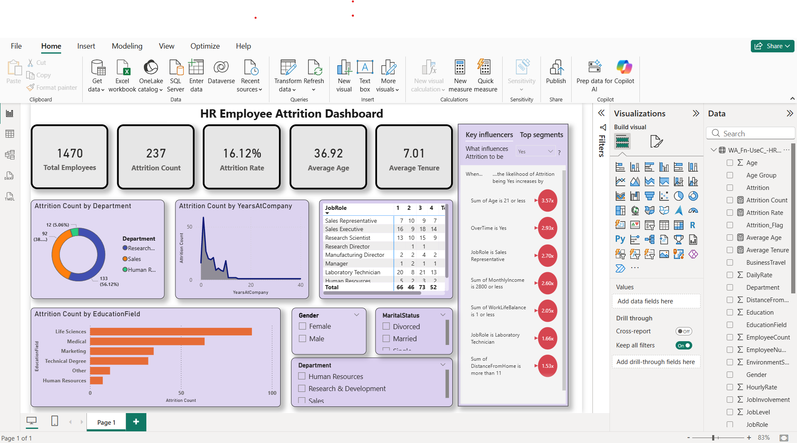

# 📊 HR Employee Attrition Dashboard

## 🔍 Overview
This project analyzes employee attrition using Power BI. It provides insights into workforce trends, employee turnover, and key factors influencing attrition such as job role, salary, and work-life balance.

## 📸 Dashboard Preview

## 📁 Files
- HR_Attrition_Dashboard.pbix

## 📊 Key Insights
- Overall attrition rate and employee distribution
- Department-wise attrition analysis
- Attrition trends based on years at company
- Impact of education field on attrition
- Key factors influencing attrition (age, overtime, salary, job role)
- Gender and marital status-based analysis

## 🛠 Tools Used
- Power BI
- Excel
- Data Modeling
- DAX (Data Analysis Expressions)
  
